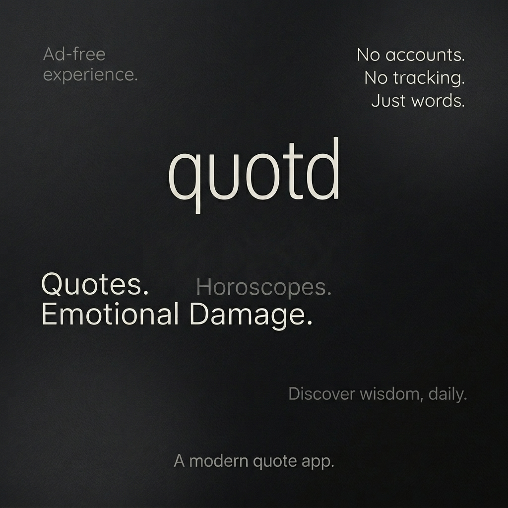

<p align="center">
  
</p>

# quotd — Quote of the Day

> A widget full of reasons, wisdom, chaos, and emotional damage.

Daily wisdom, questionable wisdom, and everything in between.  
From love letters to sarcastic horoscopes—one widget, endless moods.

---

## About

**quotd** is a minimal Android home screen widget that delivers random quotes, excuses, observations, horoscopes, bad advice, romance, emotional damage, and pure chaos directly to your home screen. The design is intentionally flat—just text on a background, nothing more. Typography first. Humor with personality. Highly shareable content.

No accounts. No internet. No tracking. Just words.

---

## Features

- **8 quote categories** — No, Chaos, Bad Advice, Emotional Damage, Love, Horoscope, Funny Insults, Office Excuses
- **Resizable layouts** — Starts at 4×1 and expands to 4×2
- **Typography customization** — Adjust Font Size (Extra Small to Extra Large) and Font Face (Sans Serif, Serif, Monospace)
- **Dynamic Themes** — Set themes to Auto (follows system), Light, or Dark, with curated presets (Default OS Monet, Ubuntu, Nothing OS, OLED Lime, Navy, Forest, Plum, Crimson)
- **Corner Shapes** — Customize the widget's corner radius (Pill, Rounded, Sharp, or OS Default)
- **Instant Configuration** — No "Apply" button needed; tweak settings and see them update on the widget instantly
- **Dynamic emoji augmentation** — Optional keyword-based emoji injection at runtime (toggle per widget)
- **Tap to copy** — Tap the quote to copy it to your clipboard; widget shows a random copy-success message for 2 seconds
- **Refresh button** — Manual refresh on the right side of the widget
- **Auto-refresh** — Quotes rotate automatically every 1 hour
- **Offline-first** — All quotes are bundled locally in JSON; no internet required
- **Flat design** — Two colors. That's it.

### Design Principles

- **Typography First** — The text is the UI
- **Minimal UI** — No chrome, no clutter
- **Fast Widgets** — Instant loads, no network calls
- **Offline First** — Works anywhere, anytime
- **Humor With Personality** — Every category has its own voice
- **Highly Shareable** — Tap, copy, send

### Emoji Engine

The original quote JSON files are **always emoji-free**. Emojis are injected dynamically at runtime by the `KeywordEmojiDecorator` — a keyword-based system that scans quotes for contextually relevant words and sprinkles in emojis that feel natural, not random.

**How it works:**
- Scans quotes for 200+ keywords (whole-word, case-insensitive)
- Picks one matching keyword and a relevant emoji
- Chooses a placement strategy: inline (60%), suffix (25%), or prefix (15%)
- 20% of the time: no emoji at all — not every quote needs one
- 20% of the time: adds a second "reaction" emoji (😂, 💀, 🤷, etc.)

**Example:**

```
Input:  "My calendar laughed when I tried to squeeze this in."
Output: "My calendar 📅 laughed when I tried to squeeze this in."
    or: "📅 My calendar laughed when I tried to squeeze this in."
    or: "My calendar laughed when I tried to squeeze this in. 😂"
```

The same quote looks slightly different every time. Can be toggled off per widget in the configuration screen. Clipboard copy always gets the original, undecorated text.

---

## Widget Types

| Widget | Initial size | Description | Status |
|--------|--------------|-------------|--------|
| quotd | 4×1 | One configurable widget for every category | ✅ Available |

> The widget starts at 4×1, can grow to any width your launcher supports, and switches to the expanded 4×2 layout when resized to two or more rows. Larger heights reuse the expanded layout. All 8 categories are available during configuration.

---

## Getting Started

### Adding a Widget

1. Long-press on your home screen
2. Select **Widgets**
3. Find **quotd** in the widget list
4. Add the 4×1 widget, then resize it from your launcher if you want more space
5. Configure category, colors, typography, and corner shapes in the setup screen
6. Adjust settings to taste—changes apply instantly. Just exit the screen when done!

### Configuring Widgets

When placing a widget, a configuration screen appears with:
- **Category selector** — Pick any of the 8 quote modes
- **Theme Mode** — Choose between Auto (follows system dark mode), Light, or Dark
- **Theme presets** — Select from dynamic dual-tone presets (Default pulls OS Monet colors, Ubuntu, Nothing OS, OLED Lime, Navy, Forest, Plum, Crimson)
- **Typography options** — Pick a Font Face (Sans Serif, Serif, Monospace) and Font Size (Extra Small to Extra Large)
- **Corner Shape** — Set the background shape (Pill, Rounded, Sharp, OS Default)
- Live preview of the widget updates instantly as you tweak settings

### Multiple Widgets

You can place multiple widgets on the same home screen, each with:
- A different category (e.g., one "No" and one "Horoscope")
- Independent color schemes
- Separate refresh cycles

---

## Categories

### 🚫 No
Thousands of creative, funny, professional, sarcastic, and absurd reasons to decline anything. From polite deflections to excuses involving time paradoxes and imaginary pets.

*Quotes for this category are provided as-is from the [no-as-a-service](https://github.com/hotheadhacker/no-as-a-service) repository.*

### 🌀 Chaos
Sarcastic observations about life, reality, and the universe. For when you need to feel seen by the void.

### 💀 Bad Advice
Terrible life advice delivered with complete confidence. Do not follow. (Seriously.)

### 💥 Emotional Damage
Truths that hurt because they're accurate. Brutal honesty delivered fresh daily.

### 💌 Love
Deeply romantic quotes for partners and hopeless romantics. The warm side of the pillow.

### 🔮 Horoscope
Sarcastic cosmic guidance from a universe that is mildly disappointed in humanity.

### 🎯 Funny Insults
Playful roasts, sarcastic burns, and harmless emotional violence. Send to friends at your own risk.

### 💼 Office Excuses
Professionally unprofessional reasons to skip meetings, avoid spreadsheets, and preserve workplace morale from a safe distance.

---

## Building from Source

### Prerequisites

- Android Studio Ladybug or later
- JDK 11+
- Android SDK 36

### Build

```bash
git clone https://github.com/codebydusk/quotd.git
cd quotd
./gradlew assembleDebug
```

### Install

```bash
adb install app/build/outputs/apk/debug/app-debug.apk
```

---

## Contributing

### Adding Quotes

1. Edit the JSON file in `app/src/main/assets/` for the target category
2. Each file is a simple JSON array of strings:
   ```json
   [
       "Your quote here.",
       "Another quote here."
   ]
   ```
3. Build and test

### Adding a New Category

1. Create a new JSON file in `app/src/main/assets/`
2. Add the category mapping in `QuoteRepository.kt`
3. Add string resources in `strings.xml`
4. Add the category entry in `QuotdWidgetConfigActivity.kt`
5. Optionally, create widget info XML files in `res/xml/` and register new receiver subclasses in `AndroidManifest.xml` for a dedicated launcher shortcut

---

## Credits

- Huge thanks to [@danny5395](https://github.com/danny5395) for the original app idea!
- Quotes for the "No" category are provided as-is from the [no-as-a-service](https://github.com/hotheadhacker/no-as-a-service) repository by [@hotheadhacker](https://github.com/hotheadhacker).

---

## Author

**Sayantan Roy** — [@codebydusk](https://github.com/codebydusk)

## License

This project is licensed under the GNU General Public License v3.0 — see the [LICENSE](LICENSE) file for details.
